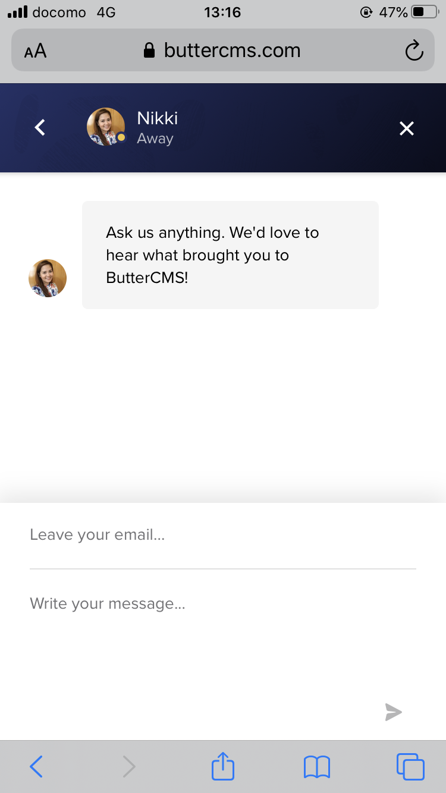

<!-- ■キーワード 筋トレ　自宅 -->
<!-- ■問題提起：読者が抱えている悩みや問題を明確にする。-->

butterCMSのPersonal planは完全無料で使えて非常に便利です。

ですが、私はbuttercmsの利用をやめました。

その理由を公開します。

## 記事作成のやり方に合わなかった

私の記事作成のやり方として、スマホで通勤電車内で使うことを希望しています。

会社から帰って書こうとしても、娘と寝てしまったり、一緒に遊んだりで思うように時間が取れません。

すきま時間=通勤電車で記事を書きたいのです。

これがbutterCMSでは実現できませんでした。

## 具体的に何がダメだったか
butterCMSの画面はレスポンシブ対応していません。もうこれだけで使いにくい。

書けなくはないですが、記事保存後に自動で意図しないhtmlタグも付与され(これは設定でなんとかなるのかも)
、思うように記事作成ができませんでした。

## ならばwrite APIが使いたい
butterCMSにはwrite APIの機能があります。

Write APIが使えれば、レスポンシブ画面が無くても、iPhoneのメモ帳と、ショートカットアプリで記事投稿ができるかもしれないと考えてました。

##buttercmsのチャットに問い合わせ
早速buttercmsのサイトにあるチャット機能を使って、コンタクトをとります。

返ってきた回答は、

**Personal planでWrite APIは利用できません。Business専用です**

butterCMSは良くも悪くもビジネス向けのサービスということですね。

残念ですが、あきらめます。

## スマホで記事を書くには
markdownの存在の知りました。現在の記事はmarkdownで書いてます。

スマホで記事を書くならmarkdownが良さそう。

しばらくmarkdownで書くスタイルでやっていきます。

<!-- 結果の明示：あなたの記事を読むとどうなるのかを具体的に伝える。-->
<!--③ 結果の根拠：②で示した結果が出る根拠を伝える。 ④ 行動：読者の行動は？（マネタイズ設計）-->