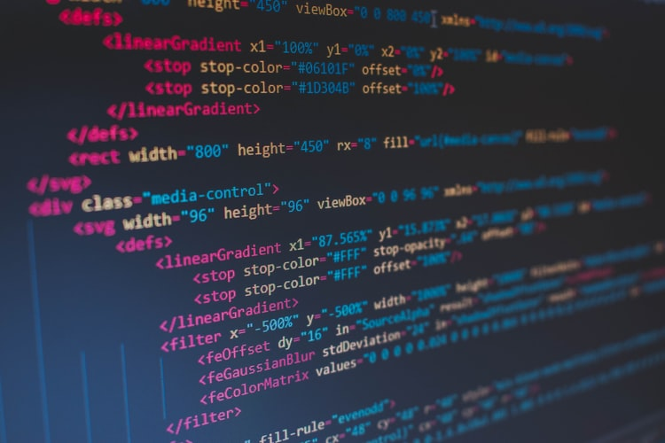

<!-- ■キーワード プログラミング 小学校 カリキュラム 必修-->
<!-- ■問題提起：読者が抱えている悩みや問題を明確にする。-->

2020年になりました。

いよいよプログラミングが小学校でも必修科目となり、カリキュラムに組み込まれますね。

* 自分はプログラミングやったことないから、子供に聞かれても教えられない。

* 子供が落ちこぼれるのも怖いし、お友達も習い事でプログラミングスクール行く人も出てきた。

* プログラミングスクールに通わせた方がいいの？

そんな悩みを大手IT企業に勤める私が回答します。

## 結論
まずはお子さんにプログラミングに触れさせてみましょう。

それで楽しそうなら続けさせてみたら良いでしょう。

他に夢中になれることがあれば、そちらを思いっきりやらせてはどうでしょうか。  

## 求められるのはプログラミング的思考
この記事を読んでる方は、プログラミングの知識があまりなく、漠然と 難しそう... と思われてるのでは、と思います。

確かにプログラマーと呼ばれる職業の方は、高度なプログラミング技術があり、複雑なソースコードを書いています。

こんなイメージですよね。  

ただ、文部科学省の学習指導要領を確認すると、プログラミング教育の目的は、プログラムを書けるようになることではないようです。 

> 子供たちが将来どのような職業に就くとしても、**「プログラミング的思考」などを育んでいくことが必要**であり、そのため、小・中・高等学校を通じて、プログラミング教育の実施を、子供たちの発達の段階に応じて位置付けていくことが求められる
  
このプログラミング的思考というのは、やりたいことを実現するために 
- 何をしなければならないか
- どの順序でやる必要があるか

を論理的に考える力です。 

この思考能力は、コンピュータを理解し上手に活用していくのに必要な力ですあり、これからの社会を生きていく子供たちにとって、将来どのような職業に就くとしても、極めて重要なこととなっています。  

## プログラミング的思考は子供に丁寧に説明することと同じです

プログラミング的思考というのは、特別なものではありません。

簡単に説明すると、**何もわからない子供に新しい物事を教える**ことと同じです。 

例えば子供にスマホで天気予報を調べてもらいましょう。

スマホを使ったことがなかったとして、きっと以下の様に教えていきますよね。 

- まず暗証番号を入れてスマホのロックを解除してね
- Chromeを開いてね
- [お気に入り]にあるYahoo!のサイトを開いてね
- 天気のメニューを押してね
- 東京の天気をみてね
- 天気を（ママ・パパ）に教えて！！

これがプログラミングです。

小さい子供に物事を教えるのに、１から１０まで丁寧に教えますよね？  

プログラミングも同じで、１から１０までやることを教えてあげる（プログラミングしてあげる）のです。  

## 子供に経験をさせてみよう
親の心配以上に、子供の吸収力はスポンジ級です。

- 論理的思考を身につけさせよう、とか
- まずは暗記させてでもやらせなきゃ　とか

そんな心配はいらないと思います。 

**まずはプログラミングに触れさせてみるのが良いでしょう。**
 
「つまんない」というのであれば、やめさせれば良いです。

「楽しい」というのであれば、どんどんやらせて、やった分だけ吸収して成長していくことでしょう。楽しみですね。  

## まずは無料で体験してみよう
いろんなプログラミングスクールがあり、最初の体験は無料というところが多い様です。

どこが良いか迷ってしまうママ・パパも多いと思います。  

各社いろんな取組をやっている様ですし、調べてみるのも良いかもしれませんね。今後このブログでも紹介していければと思っています。 

良くわからなければ、自宅から近いところで良いと思いますよ。

そんなに違いがある様にも思いませんし。

お子さんが楽しめるかどうか、まずは確認するのが良いですね！

## プログラミングは面倒な手作業を早く・便利にするもの

プログラミングはテストで点をとるためのもの、ではありません。

プログラミングは生活を豊かにするものです。  

このブログでプログラミングに興味を持っていただき、少しでも皆さんの生活のお役に立てれば、とても嬉しいです。

## おまけ
私は仕事上、プログラマーやシステムエンジニアの人と一緒に働いてますし、プログラムもみる機会がありますが、  

プログラミングを小さい時からやっていた方が良いか、やっていないと何か問題になるかというと、全くそうは思いません。 

私の職場は文系出身のプログラマー、エンジニアもたくさんいますし、逆にプログラマー、エンジニアが論理的思考力が高いかと言われると、必ずしもそうとも思いません。  

個人的にはプログラミングができると、色々な面倒な作業が自動化されて便利になることが多いので、おすすめです。