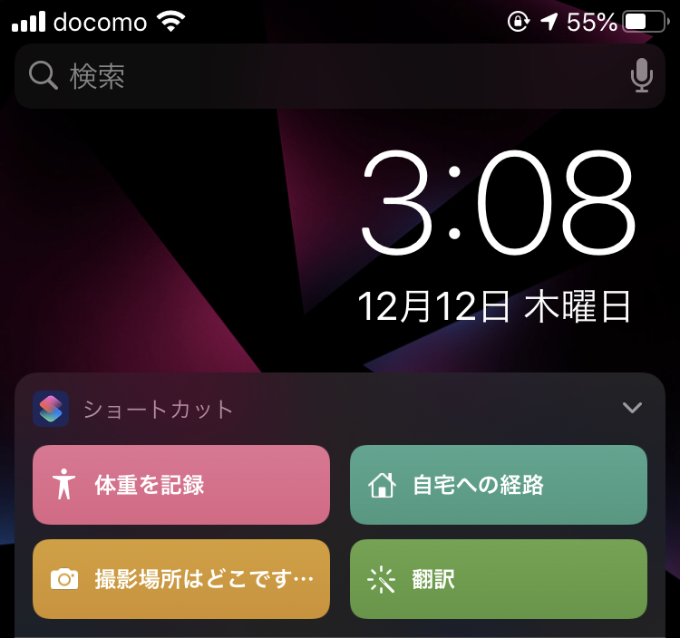
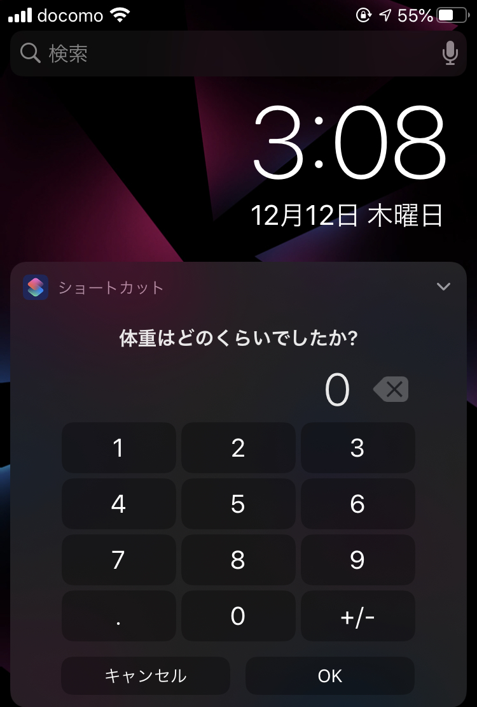
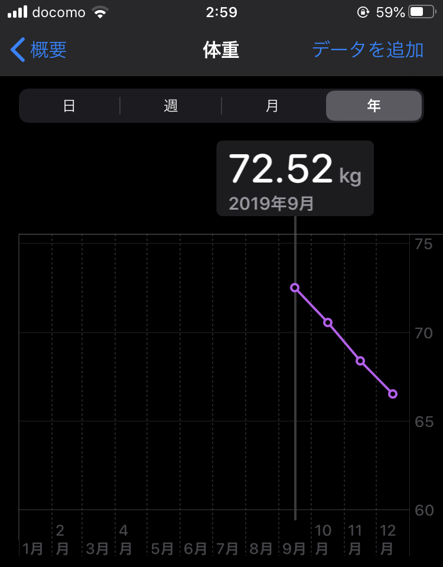
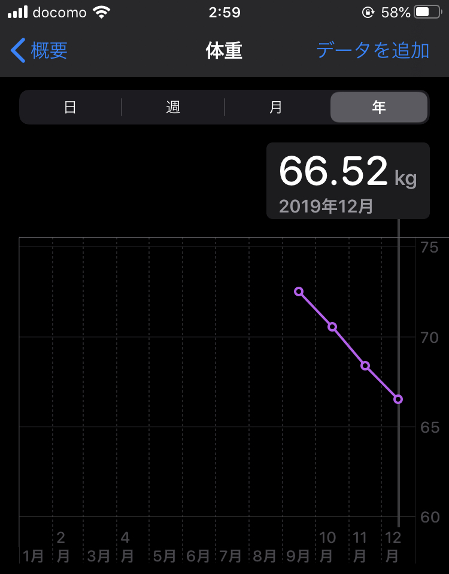

<!-- ■キーワード
筋トレ　自宅
今日から家で筋トレやるぞ。本気だす。さて、どうやるんだ。続くかな。-->
<!-- 問題提起：読者が抱えている悩みや問題を明確にする。-->

<!-- 結果の明示：あなたの記事を読むとどうなるのかを具体的に伝える。-->

この記事では、35歳の私がジムに行かずに2か月で-5kg、3か月で-7kg、6か月で-10kgに減らした方法を紹介します。

個人差はあると思いますが、やれば減ります。

このご時世、自宅で筋トレメニュー、短時間で効率良いです。

## もくじ
- 基礎代謝とカロリーの関係を知ろう
- カロリーを気にしよう
- 朝晩体重を測って、簡単に記録しよう
- 脂肪燃焼を促進しよう
- 大切なのは環境です

## HIITをまずは始める。次に基礎代謝を把握する

- HIITは1〜2日に1回で、4分だけ
- これで脂肪が燃焼しやすい体になる
- たった4分だけ、と思ってひたすらやる  
自分の基礎代謝を把握してますか？把握してないならすぐにチェックしてその数字を覚えて下さい  

## HIITを始めたら基礎代謝と食事のカロリーを把握
ジムに行かずに、お金もかけずに、自宅で1日〜2日で4分のトレーニングを始めました。次は体重の記録、摂取カロリーを意識しましょ。  
みなさん毎日どれだけのカロリー摂取してるか把握してますか？

<!--③ 結果の根拠：②で示した結果が出る根拠を伝える。

④ 行動：読者の行動は？（マネタイズ設計）-->

## HIITと基礎代謝とカロリーの関係を知ろう
目的は体重を減らすことです。体重は、基礎代謝<摂取カロリーとなることで減ります。

専門家ではありませんので、細かな理論は私も理解してませんが、Wikipediaによると、

> 基礎代謝とは、覚醒状態の生命活動を維持するために生体で自動的に行われている活動における必要最低限のエネルギーのことである

基礎代謝より摂取カロリーが多いと、余分なカロリーは脂肪として蓄えられるとのこと。

逆を言えば、基礎代謝より摂取カロリーが少なければ脂肪は減るし、体重も減るのです。考え方はシンプルにこれだけです。

## 基礎代謝、摂取カロリーを把握しよう
みなさんのご家庭には基礎代謝を測る機器、体重計はありますか？

私はダイエットする前は172cm/73.8kgのハイスペック人材で、基礎代謝は約1,600kcalと体重計から弾き出されてました。

毎日の食事のカロリー計算はこんな感じでアバウトにやりました。

- 朝ごはんは卵とご飯一杯で大体400kcal
- お昼は社食でサラダ盛り放題と魚一尾で350kcal
- 夜は鍋とご飯とお酒で700kcal
- 合計1,450kcal<基礎代謝1,600kcal

実際は会社に行ったりしてるので、1,600kcal以上消費する訳ですが、どれだけ消費されるか測る術がなかったので、私の基準は1日1,600kcalとしていました。

## 朝晩体重を測って、簡単に記録しよう
体重を習慣的に測ってますか？私は全くしてませんでした。太ってるのは自覚あるし、別に知りたくもない。という状況でした。

ですが体重は定期的に記録しましょう。結果が数字として見えた時、モチベーションになります。

私は朝/晩で測ってました。

### 簡単な記録の仕方
私はiPhoneのショートカットアプリを使っていました。
専用のアプリもあると思いますが、ただシンプルに記録したかっただけなのでこれで十分でした。

---

## 脂肪燃焼を促進しよう
短時間で効果のあるHIIT(ヒット/ヒート)をオススメします。
腹筋◯回/背筋◯回と決めてやるよりも、時間が4分と決まってるのが良いです。

私は下のYoutubeの動画を使っています。

色んな動画があるので、みなさんお気に入りのものを探してみてください。

## 大切なのは環境です
「やらなきゃいけない」というのはプレッシャーです。プレッシャーを受けながら行動するにはパワーが必要。

歯を磨く、髭を剃る、化粧する、といった毎日の作業は、やらなきゃいけない作業ですが、習慣化してるので、「極めて苦痛！」とまでは行かずにできてますよね？

同じ事です。習慣化してしまえばいいのです。

私は玄関に入ったところにヨガマットを敷いてます。

帰ってきたら、スーツを脱ぎ、着替える前にHIITをやります。

HIITを着替えの中の習慣にしてしまいましょう。

<a href="//af.moshimo.com/af/c/click?a_id=988992&amp;p_id=170&amp;pc_id=185&amp;pl_id=4062&amp;url=https%3A%2F%2Fwww.amazon.co.jp%2Fdp%2FB071L5QYFD" rel="nofollow"> LICLI ヨガマット おりたたみ トレーニングマット エクササイズマット ヨガ ピラティス マット 厚さ 10ｍｍ 「 ストラップ 収納ケース付 」「 ニトリルゴム 滑り止め マットバッグ 」 11カラー (ピンク)</a>

## 補足情報
サプリメントはこちらを使っています。
クレアチン　モノハイドレードというサプリメントで、メンタリストのあのお方の動画でも紹介されていました。

## 最後に
最後に、私の体重の推移を載せておきます。
私は上に記載したことしかやってません。

---

というわけで、今回は以上となります。
1kgでもみなさまの減量に役立てたのなら幸いです！